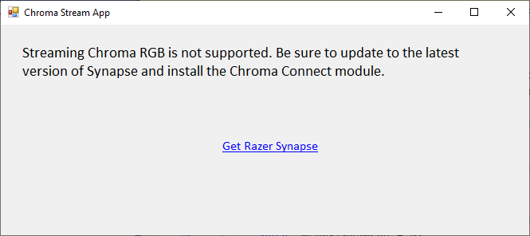
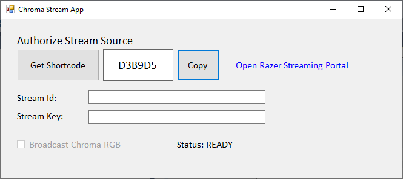
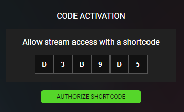
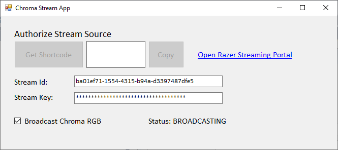

# Latest

* Visit the [Chroma Animation Guide](https://chroma.razer.com/ChromaGuide/) to find the latest supported plugin for Chroma RGB.

# CSharp_ChromaStreamApp

C# Chroma Stream App for Chroma RGB streaming.

---

**Table of Contents**

* [See Also](#see-also)
* [Steps](#steps)
* [Screenshots](#screenshots)

---

<a name="see-also"></a>

## See Also

**Docs:**

* [Chroma Animation Guide](http://chroma.razer.com/ChromaGuide/) - Visual examples of the Chroma Animation API methods

**Plugins:**

* [CChromaEditor](https://github.com/RazerOfficial/CChromaEditor) - C++ library for playing and editing Chroma animations

**Notes**

* For more information about streaming Chroma RGB check out the [streaming section](https://github.com/razerofficial/CChromaEditor#streaming) of the C++ plugin.

---

<a name="steps"></a>

## Steps

Step 1. Check for streaming support

```
bool supportsStreaming = ChromaAnimationAPI.CoreStreamSupportsStreaming();
```

Step 2. Get and copy the shortcode

```
_mShortcode = ChromaSDK.Stream.Default.Shortcode;
_mLenShortcode = 0;
string strPlatform = "PC";
ChromaAnimationAPI.CoreStreamGetAuthShortcode(ref _mShortcode, out _mLenShortcode,
  strPlatform, "C# Chroma Stream App");
```

Step 3. Check for stream id authorization every 1 second

```
_mStreamId = ChromaSDK.Stream.Default.StreamId;
_mLenStreamId = 0;
ChromaAnimationAPI.CoreStreamGetId(_mShortcode, ref _mStreamId, out _mLenStreamId);
if (_mLenStreamId > 0)
{
    _mStreamId = _mStreamId.Substring(0, _mLenStreamId);
}
```

Step 4. Check for stream key authorization every 1 second

```
_mStreamKey = ChromaSDK.Stream.Default.StreamKey;
_mLenStreamKey = 0;
ChromaAnimationAPI.CoreStreamGetKey(_mShortcode, ref _mStreamKey, out _mLenStreamKey);
if (_mLenStreamId > 0)
{
    _mStreamKey = _mStreamKey.Substring(0, _mLenStreamKey);
}
```

Step 5. Release the shortcode after authorization is complete

```
if (_mLenStreamId > 0 && _mLenStreamId > 0)
{
    if (ChromaAnimationAPI.CoreStreamReleaseShortcode(_mShortcode))
    {
        _mShortcode = ChromaSDK.Stream.Default.Shortcode;
        _mLenShortcode = 0;
    }
}
```

Step 6. Broadcast to stream Chroma RGB

```
if (_mLenStreamId > 0 && _mLenStreamKey > 0)
{
    ChromaAnimationAPI.CoreStreamBroadcast(_mStreamId, _mStreamKey);
}
```

Step 7. End the broadcast

```
ChromaAnimationAPI.CoreStreamBroadcastEnd();
```

---

<a name="screenshots"></a>

### Screenshots

* **Synapse 3 and the Chroma Connect Module are required**



* **Use the shortcode to authorize a stream source**



* **Authorize the shortcode on the [Razer Streaming Portal](https://stream.razer.com/)**



* **Broadcast to the authorized stream**


